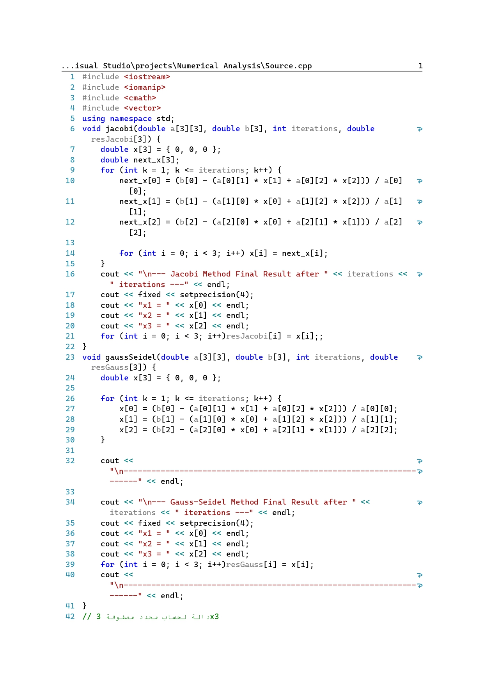
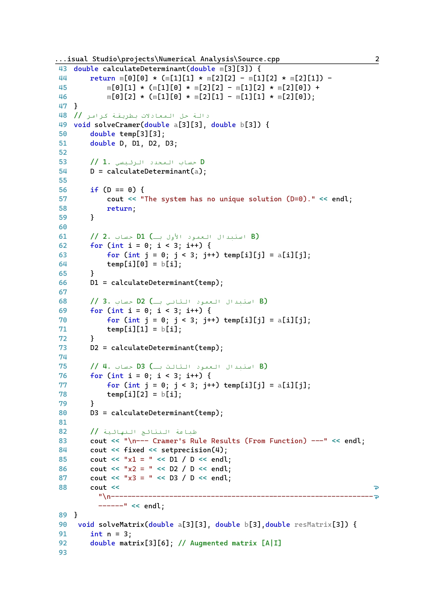
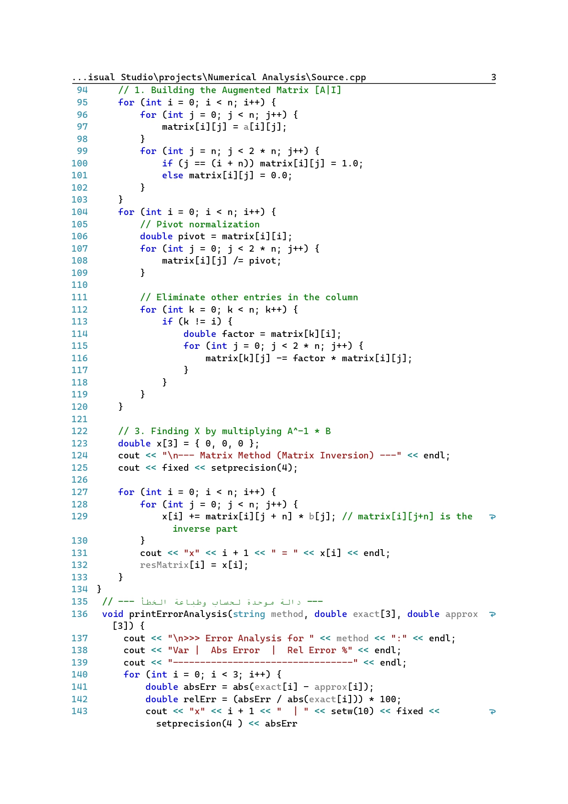
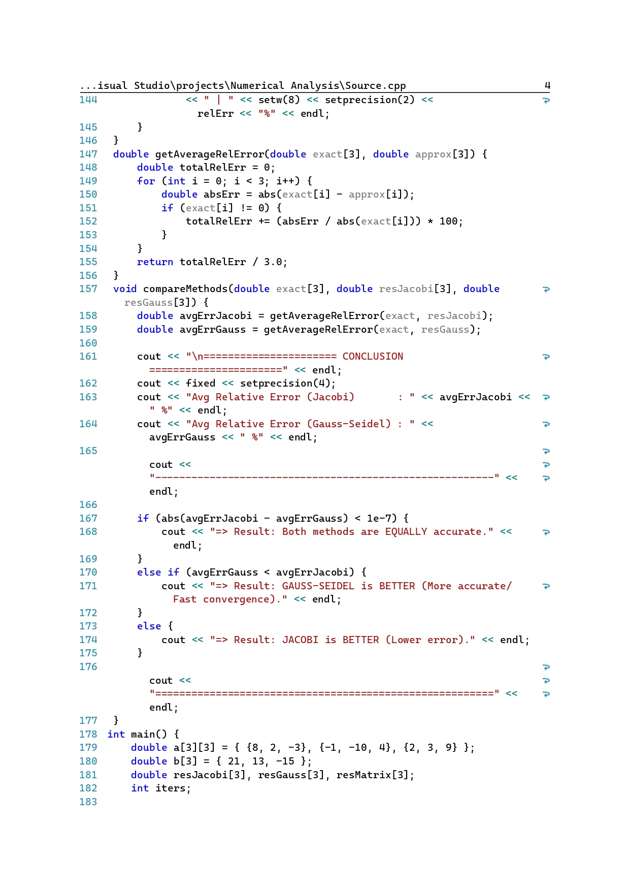
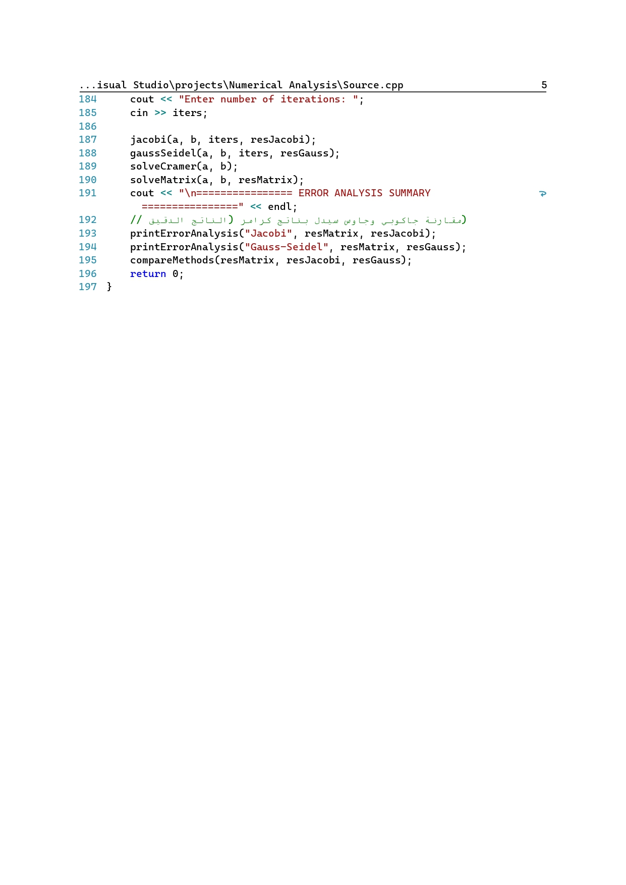
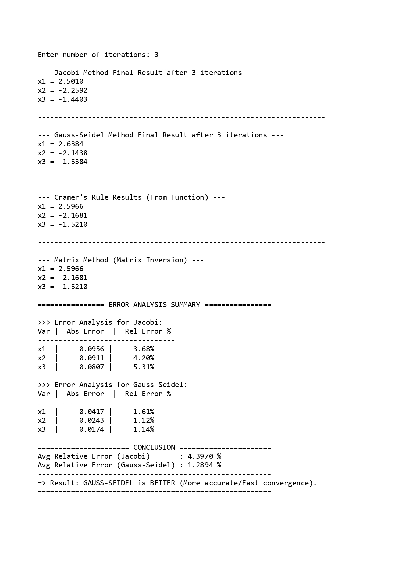

# Numerical Analysis Project - Linear Systems Solvers

Welcome to the **Numerical Analysis Project** developed for the Numerical Analysis course at **Modern Academy** (Class: **C12**). This project implements and demonstrates various direct and iterative numerical methods to solve systems of linear equations, complete with a comprehensive error analysis comparison.

---

## 👥 Team Members

* **Mark Nader Kamal Saad** - Code: `12500407`
* **Omar Eid Mohamed** - Code: `12500187`
* **Youssef Saber Salama Awad Elian** - Code: `12500327`
* **Ahmed Hamdy Ahmed Mahdy** - Code: `12500725`

---

## 📌 Methods Implemented

This project covers four major methods divided into two core categories:

### 1. Iterative Methods (Approximate Solutions)
* **The Jacobi Method:** Solves each equation for one variable and uses the values from the previous iteration to calculate the next approximation.
* **The Gauss-Seidel Method:** Similar to Jacobi but utilizes the newly computed values immediately within the same iteration for faster convergence.

### 2. Direct Methods (Exact Solutions)
* **The Cramer's Rule:** Uses determinants of matrices to find exact and unique solutions.
* **The Matrix Method (Gauss-Jordan Elimination / Inversion):** Solves the system using the matrix inversion formula $X = A^{-1} \cdot B$ through row reduction operations.

---

## 🧮 Mathematical Overview & Example

The system implemented and analyzed in this project is defined as:
$$8x_{1} + 2x_{2} - 3x_{3} = 21$$
$$-x_{1} - 10x_{2} + 4x_{3} = 13$$
$$2x_{1} + 3x_{2} + 9x_{3} = -15$$

### Comparison of Final Results:
* **Exact Solution (Cramer / Matrix):** $x_1 = 2.596$, $x_2 = -2.168$, $x_3 = -1.521$
* **Jacobi Approximation (3rd Iteration):** $x_1 \approx 2.501$, $x_2 \approx -2.259$, $x_3 \approx -1.440$
* **Gauss-Seidel Approximation (3rd Iteration):** $x_1 \approx 2.638$, $x_2 \approx -2.143$, $x_3 \approx -1.538$

---

## 📊 Error Analysis

An explicit error analysis was conducted by measuring the difference between the **Exact** and **Approximate** solutions using Absolute Error ($E_a$) and Relative Error ($E_r$):

$$E_{a} = |x_{exact} - x_{approx}|$$
$$E_{r} = \left| \frac{x_{exact} - x_{approx}}{x_{exact}} \right| \times 100\%$$

### Results Summary:
* **Gauss-Seidel** achieved a lower relative error compared to the **Jacobi method** within the same number of iterations, showcasing its superior and faster convergence rate.

---

## 📷 Code & Output Previews

Below are the screenshots detailing the code implementation and execution results:

### Source Code Pages
| Page 1 | Page 2 |
|--- |--- |
|  |  |

| Page 3 | Page 4 |
|--- |--- |
|  |  |

| Page 5 |
|--- |
|  |

### Program Execution & Output
* **Terminal Output:**


---

## 🚀 How to Run the Project

1. **Clone the repository:**
   ```bash
   git clone [https://github.com/youssefsaber592-netizen/linear-systems-numerical-solver.git](https://github.com/youssefsaber592-netizen/linear-systems-numerical-solver.git)
